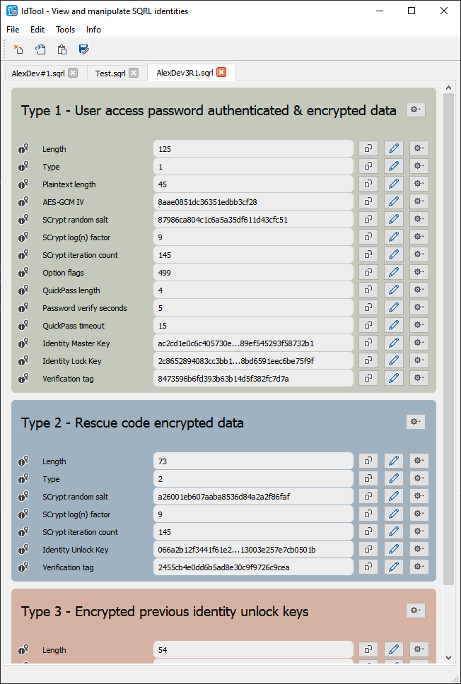

# IdTool
A utility for inspecting and manipulating SQRL identities.

## Features

### Visual representation of SQRL identities
SQRL employs its own binary identity storage format called "S4". While being lightweight, compact and extensible, S4 binary data is not human-readable, unlike alternative formats such as Json and Xml. This makes it hard for users and even developers to quickly check the contents of a SQRL identity stored in S4.

IdTool displays a nice visual representation of each of the identity's binary blocks and allows a quick inspection of the values encoded within the identity.

### Parsing of custom identity blocks
IdTool does not employ simple static parsing of the S4 format. 

Instead, it uses **json templates** for dynamically parsing identity blocks. IdTool comes with pre-built json templates for all currently known block types (Types 1, 2 and 3).

This approach makes it possible to parse custom identity block types, only by supplying the corresponding json template.

### Manipulating identity files
IdTool lets the user change all identity values and save the modified data back to disk. 

This makes it an ideal tool to create "rogue" identity files for hardening the parsing code of any SQRL client application that needs to read/parse SQRL identity files.

## Platforms
IdTool was written in C++ using the [Qt Framework](https://www.qt.io) and can therefore be compiled for all platforms supported by the Qt framework. Among those are the Windows, Linux and MacOS.

IdTool is currently being developed and tested on Windows only, any help with testing it on other platforms is highly appreciated.

## Roadmap
There are some features I would still like to implement, like for example dynamically adding and rearranging blocks within the GUI.
